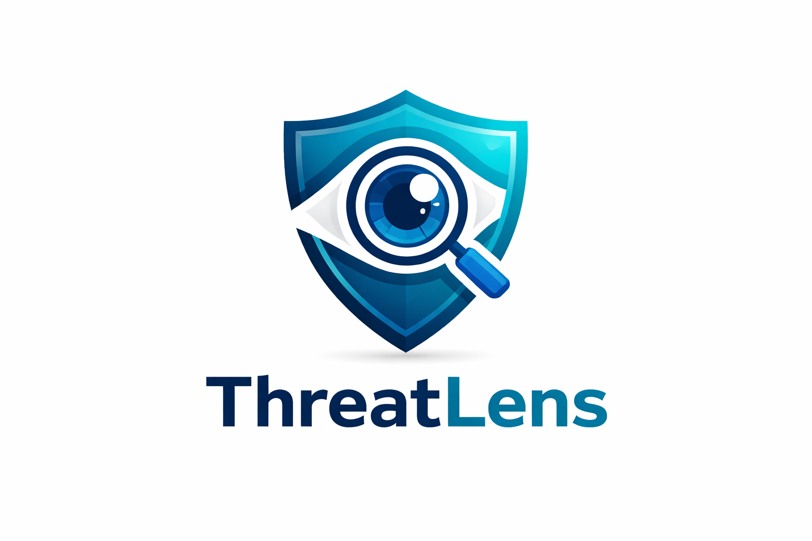

# 🔐 ThreatLens           - An Intelligent Security Monitoring & Detection Engine

<p align="center">
  
</p>


---

## 🚀 Overview

**ThreatLens** is a mini **SIEM (Security Information and Event Management)** system designed to simulate real-world security monitoring.

It ingests logs, normalizes them, detects threats using **rule-based logic and machine learning**, and visualizes alerts via a dashboard.

Inspired by enterprise tools like Splunk and Elastic Stack.

---

## 🧩 Features

* 🔍 Log Parsing & Normalization
* ⚡ Real-time Log Monitoring (Watchdog)
* 🛡️ Rule-based Detection

  * Brute Force Attacks
  * Suspicious Activity
* 🤖 ML-based Anomaly Detection (Isolation Forest)
* 🌐 REST API using Flask
* 📊 Dashboard using Streamlit
* 🐳 Dockerized Deployment

---

## 🏗️ Architecture

Logs → Parser → Normalizer → Detection Engine → ML Model → Alerts → API → Dashboard

---

## 🚨 Detection Capabilities

* 🔐 Brute Force Attack Detection
* 📡 Suspicious IP Activity
* 📈 High Request Frequency Detection
* 🤖 Anomaly Detection using Machine Learning

---

## 📸 Dashboard Preview

*Add your screenshot here (screenshots/dashboard.png)*

---

## ⚙️ Tech Stack

* Python
* Flask
* Streamlit
* Scikit-learn
* NumPy
* Docker

---

## 📁 Project Structure

```
threatlens-siem
│
├── data/
├── src/
├── dashboard/
├── reports/
├── Dockerfile
├── requirements.txt
└── README.md
```

---

## ▶️ Getting Started

### 1️⃣ Clone the Repository

```
git clone https://github.com/your-username/threatlens-siem.git
cd threatlens-siem
```

---

### 2️⃣ Install Dependencies

```
pip install -r requirements.txt
```

---

### 3️⃣ Run Detection Engine

```
python src/main.py
```

ThreatLens now loads sources from `data/log_sources.json`, so you can combine:

* file-based logs
* Windows Event Logs (`Security`, `Application`, `System`)

Edit that config file to enable or disable sources and tune `max_events`.

---

### 4️⃣ Run API

```
python src/api.py
```

Useful endpoints:

* `/health` → service status
* `/analyze` → generated alerts
* `/events` → normalized ingested events

---

### 5️⃣ Run Dashboard

```
streamlit run dashboard/app.py
```

---

## 🐳 Run with Docker

```
docker build -t threatlens .
docker run -p 5000:5000 threatlens
```

---

## 🧪 Attack Simulation (Optional)

You can simulate real attacks to test detection:

* Brute Force → Hydra
* Port Scan → Nmap
* Traffic Flood → Curl

---

## 📌 Why This Project Matters

ThreatLens demonstrates real-world **Security Operations Center (SOC)** concepts:

* Log analysis
* Threat detection
* Detection engineering
* Security automation

This project is ideal for roles like:

* Security Analyst
* SOC Analyst
* Security Engineer

---

## 📈 Future Improvements

* Real-time alert notifications (Slack/Email)
* Cloud log integration (AWS/GCP)
* Advanced ML models
* Role-based dashboard

---

## 👨‍💻 Author

**Niranjan G**

---

## 📜 License

This project is licensed under the MIT License.
